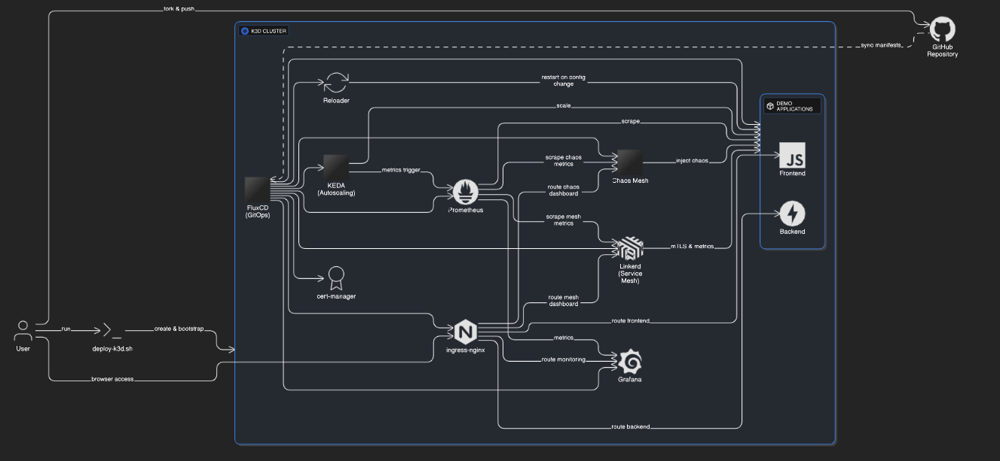

# GitOps Chaos Engineering Demo

Kubernetes GitOps Homelab with Flux, Linkerd, Cert-Manager, Chaos Mesh & Prometheus

## Architecture Overview



## What This Repo Contains

- **Applications**: Python backend + HTML frontend microservices
- **GitOps**: FluxCD configuration for automated deployments
- **Chaos Engineering**: Chaos Mesh schedules
- **Monitoring**: Prometheus + Grafana dashboards for observability
- **Deployment**: One-command setup script for local Kind cluster

## What It Does

1. **Deploys microservices** using FluxCD GitOps from this Git repository
2. **Apply Chaos Experiments** regarding pods, network and other k8s components
3. **Monitors chaos impact** with Prometheus metrics and Grafana dashboards
4. **Self-heals** through Kubernetes Deployment controllers (pods auto-restart)
5. **Syncs changes** - any Git commits automatically deploy to cluster

## Quick Start

```bash
# Clone and deploy everything (auto-installs prerequisites)
git clone https://github.com/gianniskt/k8s-gitops-chaos-lab.git
cd k8s-gitops-chaos-lab
chmod +x scripts/deploy.sh
./scripts/deploy.sh
```

**No manual installation needed!** The script automatically detects and installs:
- **Docker** (Linux: apt/yum, macOS: Homebrew, Windows: manual prompt)
- **Kind** (Kubernetes in Docker)
- **kubectl** (Kubernetes CLI)
- **Helm** (Package manager)
- **Flux CLI** (GitOps status and management)

The script will:
- Create Kind cluster `gitops-chaos`
- Build and load Docker images locally
- Install FluxCD Operator
- Deploy GitOps components (Flux, cert-manager, Linkerd service mesh, monitoring stack)
- Deploy applications (backend, frontend microservices)
- Deploy chaos engineering experiments and schedules
- Configure monitoring and observability dashboards

## Access Dashboards

```bash
# Grafana (monitoring)
kubectl port-forward svc/kube-prometheus-stack-grafana -n monitoring 3000:80
# Open: http://localhost:3000 (admin/prom-operator)

# Linkerd (service mesh observability)
kubectl port-forward svc/web -n linkerd-viz 8084:8084
# Open: http://localhost:8084

# Chaos Mesh (experiments)  
kubectl port-forward svc/chaos-dashboard -n chaos-testing 2333:2333
# Open: http://localhost:2333 (copy/paste chaos token from output)
```

## Watch Chaos in Action

```bash
# Watch pods getting killed
kubectl get pods -n app-backend -w

# Check chaos schedule status
kubectl get schedule -n chaos-testing
```

## Project Structure

```
k8s-gitops-chaos-lab/
├── scripts/                    # Deployment and troubleshooting scripts
├── app/                        # Demo applications (backend/frontend microservices)
└── gitops/                     # GitOps configurations and Kubernetes manifests
```

## Cleanup

```bash
kind delete cluster --name gitops-chaos
```

**Note**: You can redeploy everything by running `./scripts/deploy.sh` again.

---

**Stack**: Kind • FluxCD • Chaos Mesh • Linkerd • Prometheus • Grafana • cert-manager • Reloader • Docker